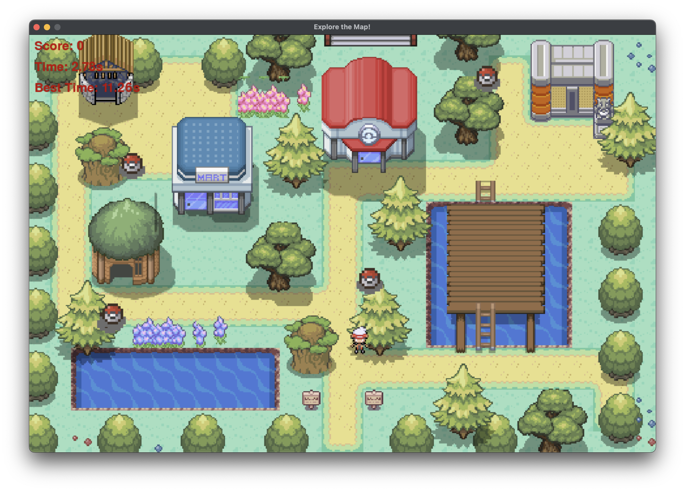

# Explore the Map! 🎮



## Overview 🗺️

"Catch Pokeballs!" is a game where the player navigates through a map to collect pokeballs. The game uses the Entity-Component-System (ECS) architecture to manage game entities and their behaviors.

## Features ✨

- Navigate through a map to collect pokeballs.
- The game keeps track of the best time to collect all pokeballs.
- Uses ECS architecture for better organization and scalability.

## ECS Architecture 🏗️

The game is built using the ECS (Entity-Component-System) architecture:

- **Entity**: A general-purpose object that can have multiple components.
- **Component**: Holds data and attributes for entities.
- **System**: Contains logic to process entities with specific components.

## Map Creation 🗺️

The map was created using [Tiled](http://www.mapeditor.org), a popular map editor. The Pokemon tilesets used in the game was downloaded from the following sources:

- [Magiscarf on DeviantArt](https://www.deviantart.com/magiscarf/art/Tileset-ver-3-Free-690477146)
- [Pokemon Trash](https://www.pokemontrash.com/club/rpg-maker/ou-trouver-des-tilesets-complets/)
- [OpenClassrooms Forum](https://openclassrooms.com/forum/sujet/probleme-avec-des-collisions-en-python)
- [DescendedFromUllr on DeviantArt](https://www.deviantart.com/descendedfromullr/art/Pokeball-Tileset-775520601)

## Setup 🛠️

1. Clone the repository:
    ```sh
    git clone <repository-url>
    cd <repository-directory>
    ```

2. Activate the virtual environment:
    ```sh
    source venv/bin/activate
    ```

3. Run the game:
    ```sh
    python ECSGameFV.py
    ```

## Known Issues 🐞

- There are minor bugs with collisions with objects. 

## License 📜

This project is licensed under the MIT License. See the [LICENSE](LICENSE) file for details.